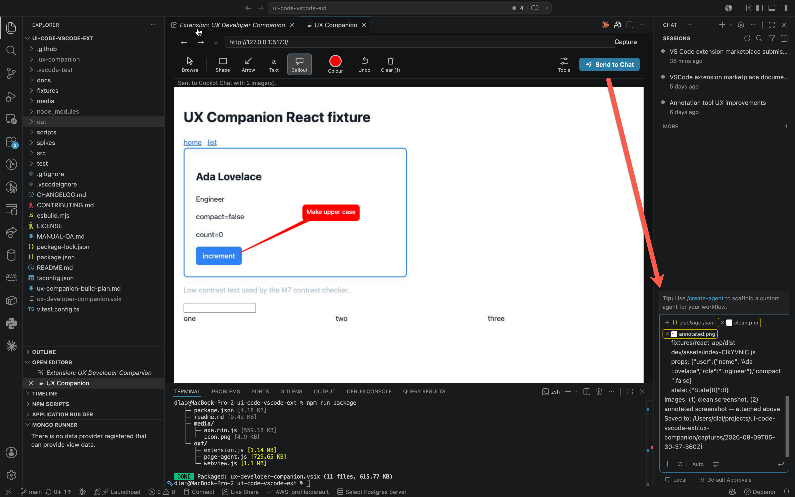

# User guide

Everything the extension does, in the order you are likely to need it.

- [The panel](#the-panel)
- [Annotating](#annotating)
- [Send to Chat](#send-to-chat)
- [Inspector](#inspector)
- [Responsive tools](#responsive-tools)
- [Colour and accessibility](#colour-and-accessibility)
- [State lab](#state-lab)
- [Settings reference](#settings-reference)

---

## The panel

Run **UX Companion: Open Browser Panel** from the Command Palette. The extension discovers a local
Chromium-family browser (Edge → Chrome → Chromium), launches it headless with a dedicated profile,
and streams it into the panel over the Chrome DevTools Protocol.

The browser is a real browser. Your service worker, your `localStorage`, your WebSocket, your CSS
`@supports` — all of it behaves as it does in a normal window, because it *is* one.

**Navigation bar.** Type a URL and press Enter. Back, forward, and reload work as expected.

**Browse is a toggle.** With Browse on, clicks, keystrokes, and wheel events are forwarded to the
page. With it off, the panel is parked: clicks do nothing. Picking any annotation tool switches
Browse off, and finishing a mark leaves the panel parked, so a stray click can neither draw again
nor navigate away from the screen you are documenting. `Esc` disarms the current tool.

**Tools toggle.** The responsive, inspector, and testing panels live behind a **Tools** toggle to
keep the default view close to just-a-browser.

**Cleanup.** Closing the panel tears down the whole browser process tree. If you ever suspect a
stray process, `pgrep -f browser-profile` should return nothing.

## Annotating

| Tool | Key | Behaviour |
|---|---|---|
| **Shape** | `B` / `C` | Box or circle. Pressing the button again switches between the two; the icon shows which is active. |
| **Arrow** | `A` | Click-drag from tail to head. |
| **Text** | `T` | A haloed label with no bubble, for labelling rather than commenting. |
| **Callout** | `O` | Click-and-drag: press on the thing you are commenting on to set the tail target, then drag out to place the bubble. It starts about ten characters wide and grows as you type. Filled in the annotation colour with white text, so a comment reads as a comment and not as part of the UI. |
| **Undo** | `⌘Z` | Removes the last mark. |
| **Clear** | — | Removes all marks. |

**Colour.** One swatch with a colour picker, defaulting to solid red.

**Marks are anchored in page CSS pixels**, not screen pixels. Scroll the page, resize the panel, or
switch device presets, and the marks stay on the thing they were drawn on.

**Marks persist in every mode** — while browsing, while parked, while a tool is armed — until you
clear them or send them.

## Send to Chat

`cmd+alt+p` / `ctrl+alt+p`, or the **Send to Chat** button.

This opens Copilot Chat in agent mode and attaches:

1. **A clean screenshot** of the current viewport.
2. **The annotated screenshot**, with your marks burned in.
3. **A short context block** — URL, route, viewport size, active emulation state, and any text you
   wrote on callouts and labels, under "Notes on the annotated screenshot".

A send in progress. The panel reports *Sent to Copilot Chat with 2 image(s)*, and the chat input on
the right holds `clean.png` and `annotated.png` as real attachments above the context block — not
pasted text, and not a link the model has to go fetch.

Both PNGs are also written to `uxCompanion.captureDir` (default `.ux-companion/captures`) alongside
the context text, so you have a record independent of the chat session.

**A successful send clears the annotations** — they are in the attached image at that point. A send
that fails keeps them, so nothing is lost.

**Why the context block is short.** Earlier versions included a per-annotation dump of component,
props, state, and ranked source files. It was the bulk of the prompt and mostly restated what the
annotated image already shows. Only the text you write carries through now.

### The clipboard command is not the chat path

**UX Companion: Copy Annotated Screenshot to Clipboard** exists as a convenience for pasting into
*other* applications — a ticket, a Slack message, a doc.

It is deliberately not how images reach chat. VS Code's chat paste handler returns early unless
some installed extension enables the `chatReferenceBinaryData` API proposal, so pasting a screenshot
into Copilot Chat silently attaches nothing on a stock install. Use Send to Chat.

## Inspector

Supports **React** and **Angular** via a page agent injected at document start.

- **Component tree** — the rendered hierarchy, not the DOM.
- **Click-to-pick** — click an element to select the component that rendered it.
- **Live prop/state editing** — edit a value and the component re-renders. React goes through the
  renderer interface; Angular goes through signals plus `applyChanges`.
- **Source-file resolution** — a ranked search mapping the component to a file in your workspace.

### What "ranked" means

Source resolution returns a best match *and its runner-ups*. Measured against real repositories,
ranked top-1 accuracy is roughly **87% for React** and **95% for Angular**. Treat the path as a
strong hint, not a fact.

### Build-mode caveats

- **Angular needs a dev build.** `window.ng` only exists in development mode. Against a production
  build, the adapter reports that it cannot resolve components rather than guessing.
- **React production builds are read-only.** Props and state stay readable, but component names are
  minified. The inspector reports the build as degraded, skips source-file resolution, and
  **refuses** overrides rather than silently dropping them.

## Responsive tools

**Device presets** apply width, height, device pixel ratio, touch emulation, and user agent
together — iPhone SE, iPhone 15, iPhone 15 Pro Max, Pixel 8, Galaxy S24, iPad, Desktop 1080p, and
Desktop 1440p. Rotation is one click.

**Breakpoint slider.** Rather than shipping a guess at standard breakpoints, the extension reads the
media queries out of *your app's own stylesheets* and builds the slider from them. Dragging it
snaps to the widths your CSS actually cares about.

**Responsive matrix** renders several viewports at once for a side-by-side comparison.

> Cross-origin stylesheets cannot be read by the page, so breakpoint detection only covers
> stylesheets your page can access. A CDN-hosted stylesheet without CORS headers is invisible.

## Colour and accessibility

**Eyedropper.** Picks the colour under the cursor and reports not just the value but the **CSS
custom property that produced it and the rule where that property is defined**. This is the
difference between "it's `#4A5568`" and "it's `--color-text-muted`, defined in `theme.css` on
`:root`".

**Contrast checking.** WCAG 2.1 contrast ratio at a point, with large-text awareness and a pass/fail
verdict against AA and AAA.

**Vision-deficiency emulation.** Protanopia, deuteranopia, tritanopia, achromatopsia, blurred
vision, and reduced contrast, applied by the browser's own rendering path.

**Media emulation.** Flip `prefers-color-scheme`, `prefers-reduced-motion`, and other media features
without touching your OS settings.

**Accessibility subtree** shows the computed a11y tree for the selected node.

**axe-core scan.** A full axe-core run against the live page, bundled in the extension — no network
call, no CDN.

## State lab

**Pseudo-state forcing.** Pin `:hover`, `:focus`, or `:active` on an element so you can screenshot a
hover state without holding the mouse still.

**Request interception.** Rules match on a URL substring and an optional method, and do one of:

| Action | Effect |
|---|---|
| `fail` | Return the given HTTP status. |
| `delay` | Hold the request for N milliseconds, then let it through. |
| `mock` | Fulfil with your own status, body, and content type. |

**Network throttling.** Presets for `none`, `slow-3g` (400 ms latency, 400 kbps), `fast-3g`
(150 ms latency, 1.6 Mbps down), and `offline`.

**Storage profiles.** Snapshot `localStorage`/`sessionStorage`/cookies under a name, then restore
that snapshot later — a logged-out profile, an onboarding-incomplete profile, a power-user profile.

**State matrix** renders several forced states side by side.

## Settings reference

| Setting | Default | Notes |
|---|---|---|
| `uxCompanion.browserPath` | *(empty)* | Absolute path to Edge/Chrome/Chromium. Empty means auto-discover: Edge → Chrome → Chromium. Set this if discovery fails or you want a specific channel. |
| `uxCompanion.screencastQuality` | `60` | JPEG quality for the stream, 10–100. Frame rate is never reduced to save bandwidth — the stream pauses when idle instead. Raise it for colour-critical work; lower it on a slow machine. |
| `uxCompanion.captureDir` | `.ux-companion/captures` | Workspace-relative. Add it to `.gitignore` unless you want captures in version control. |

---

Something unclear or missing? [Open an issue](https://github.com/dlai0001/ux-developer-companion/issues) —
documentation gaps are treated as bugs.
